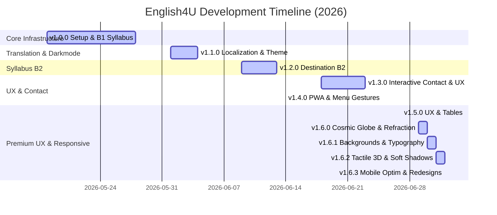

# 📑 CHANGELOG — English4U

All notable changes to the **English4U** project are documented below. This project adheres to **Semantic Versioning** (`vMAJOR.MINOR.PATCH`).

---

## 📊 Project Status & Quick Stats

| Key Metrics         | Value / Badges                                                                                                                             |
| :------------------ | :----------------------------------------------------------------------------------------------------------------------------------------- |
| **Current Version** |                                               |
| **Framework**       |                                  |
| **Styling**         |                                              |
| **Language**        |                           |
| **Build Status**    |  |

---

## 🗺️ Release Roadmap & Summary



---

## 🚀 v1.6.3 — Mobile Optimization & Contact Redesign

> **Release Date:** July 2, 2026 • _Focus: Performance Optimizations, Mobile Lag Reductions, Contact Page Premium Glassmorphism, and Learning Explorer Spacing & Alignment Fixes_

```
┌──────────────────────────────────────────────────────────────────┐
│  ✨ Highlights:                                                  │
│  • Eliminated mobile WebGL initialization lag by safeguarding     │
│    ThreeDCanvas with mounted/hydration checks and responsive bounds│
│  • Disabled dynamic displacement filters & shimmer tickers globally│
│  • Temporarily disabled unused 3D Grammar Book & Global Globe      │
│  • Redesigned Contact Page to a premium responsive glassmorphic    │
│    asymmetric layout with modern title gradients & unified cards  │
│  • Fixed Mobile Learning Explorer unit titles alignment and       │
│    shortened the unit dividers with horizontal margin indents      │
└──────────────────────────────────────────────────────────────────┘

### ⚡ Performance & Mobile Optimizations
- **ThreeDCanvas Safeguard**: Added `mounted` state checking to prevent WebGL contexts from rendering on mobile devices during initial hydration/paint.
- **Liquid Glass Displacements**: Commented out SVG wave refraction displacement filters on all cards and dropdowns to improve scrolling performance on both desktop and mobile.
- **3D Scenes Restructuring**: Commented out the unused conditional rendering loops for the 3D Grammar Codex book and Global Network globe inside `<ThreeDCanvas>` to reduce render loop thread weight.

### 🎨 Premium UI & Redesigns
- **Contact Page**: Redesigned the entire route into a premium asymmetric dual-card interface.
  - Wrapped both columns in `.liquid-glass .border-3d .shadow-3d-card` containers with generous responsive paddings (`p-6 sm:p-8 md:p-10`) and modern rounded corners (`rounded-[30px]`).
  - Added a modern color-gradient text-gradient to the `"Keep in touch."` title.
  - Aligned inputs, file uploads, text areas, and social media channels onto a layered, clean glass surface.
  - Fixed responsive title scaling to prevent wrapping issues on small mobile devices.

### 🐛 Layout & Bug Fixes
- **Learning Explorer Title Alignment**: Added `text-left` and `px-2 sm:px-4` to the unit accordion triggers in `learning-explorer.tsx` to prevent default browser centering on mobile buttons.
- **Unit Divider Line Length**: Indented `<AccordionItem>` elements using `mx-4 sm:mx-6` to make the bottom border lines shorter and avoid touching the outer card borders.

---

## 🚀 v1.6.2 — Tactile 3D & Soft Shadows

> **Release Date:** July 2, 2026 • _Focus: Tactile 3D Design System, Responsive Text Gradients, Full-Width Vocab Cloud, Glassmorphic Sidebar & Tab Blur, and Mobile Controls Adjustments_

```
┌──────────────────────────────────────────────────────────────────┐
│  ✨ Highlights:                                                  │
│  • Redesigned UI to a premium tactile 3D style using soft shadows  │
│  • Replaced harsh solid black borders with elegant translucent ones│
│  • Applied premium responsive text gradients in Hero & Explorer   │
│  • Expanded interactive 3D Vocab Cloud to full viewport width     │
│  • Applied glassmorphic backdrop-blur to Index Menu & Tabs       │
│  • Repositioned mobile scroll buttons and built draggable index  │
└──────────────────────────────────────────────────────────────────┘
```

### 🎨 Tactile 3D Design System & Soft Shadows

- **Soft 3D Shadows:** Redefined the global `.shadow-3d-btn`, `.shadow-3d-card`, and `.shadow-3d-popup` to use a soft `--shadow-3d-color` variables (`rgba(36, 36, 36, 0.15)` in light mode, `rgba(226, 193, 97, 0.18)` in dark mode) for a smooth **gradual-blur** shadow rather than solid black blocks.
- **Translucent Borders:** Softened `.border-3d` to use a semi-translucent gray border in light mode (`rgba(36, 36, 36, 0.12)`) and gold-tinted translucent border in dark mode, removing the solid black outlines globally.
- **Settings & Card Overrides:** Set the navbar Settings button to use transparent borders to let the 3D soft shadow stand out, and overrode the outer Live Playground card's border to a translucent white border (`!border-white/40 dark:!border-white/10`).
- **All Tabs 3D:** Styled all playpen tab buttons (active and inactive) to be 3D blocks. Inactive tabs now have a soft background, light borders, and soft shadows, lifting on hover.

### 🌈 Premium Text Gradients & Background Layer

- **Responsive Text Gradients:** Applied vibrant, responsive gradients to Hero and Learning Explorer headings (translating from charcoal/deep-purple to warm coral/fresh-mint in light mode, and stardust gold to warm peach/white in dark mode).
- **Subtitles & Cursors:** Styled subtitles with a readable metallic fade and customized blinking typing cursors with matched gradient accents.
- **Section Background Image:** Integrated `/imgs/bg8.png` as an absolute background image layer (`-z-10`) behind all Learning Explorer contents.
- **Glassmorphic Index Menu & Tabs:** Applied `bg-paper-canvas/30 backdrop-blur-lg` to the desktop Left Sidebar ("Units Index") and global `TabsList` elements, rendering underlying backgrounds with premium glassmorphic frosted blur.

### 📱 Mobile UI & Layout Adjustments

- **Draggable Snapping Syllabus Index:** Replaced the purple syllabus button with a draggable glassmorphic bubble menu button featuring a Menu icon, including edge-snapping (16px left/right bounds) and vertical boundary clamping.
- **WebGL Mobile Off-loading:** Disabled `<ThreeDCanvas>` rendering on screens under `768px` in `book-selection.tsx` and `ThreeDWorkspace.tsx` to optimize mobile battery life and performance.
- **Scroll Controls Repositioning:** Moved mobile speed-sensitive scroll buttons to the bottom center of the screen (`fixed bottom-6 left-1/2 -translate-x-1/2`).
- **Full-Width Vocab Cloud:** Restructured `book-selection.tsx` to stretch the interactive 3D Vocab cloud across the full screen viewport, letting the rounded book cards float in the center on top.

---

## 🚀 v1.6.1 — Shared Backgrounds & Rainbow Typography

> **Release Date:** July 1, 2026 • _Focus: Unified Shared Section Backgrounds, Calibrated Rainbow Text Gradients, 3D Background Integration & Refractive Glass Navbar_

```
┌──────────────────────────────────────────────────────────────────┐
│  ✨ Highlights:                                                  │
│  • Unified background wrappers using bg4.png & bg8.png images      │
│  • Calibrated, high-end rainbow text gradients for headings/badges │
│  • 3D Vocab Cloud Constellation integrated as a section background│
│  • Gradual blur component converted to scroll-reactive glass      │
│  • Gradual glassmorphism applied as the Navbar's background      │
└──────────────────────────────────────────────────────────────────┘
```

### 🖼️ Unified Homepage Background Wrappers

- **Shared Background Layouts:** Wrapped the homepage sections into two containers with inline background styles (`bg4.png` and `bg8.png`), creating a smooth visual path across sections instead of separated gradient stripes.
- **Fixed Stacking Context:** Declared z-index stacking boundaries (`z-0` on parent, `-z-10` on absolute backgrounds) to prevent background images from slipping behind the page body canvas.
- **404 About Redirect:** Fixed desktop and mobile navbar links to redirect "About" clicks safely back to `/` homepage, avoiding a 404 page error.

### 🌈 Calibrated Rainbow Typography

- **Rainbow Heading Gradients:** Replaced solid `text-ink` and simple two-color gradients with a premium, calibrated rainbow spectrum (`linear-gradient`) on all section headers. Light mode has deep, readable contrast tones while dark mode glows with vibrant neons.
- **Synchronized Badges:** Standardized all section subtitles to a unified capsule format using `.section-badge` and `.text-gradient-badge` with synchronized rainbow text gradients.
- **Refined Body Text Colors:** Replaced grey tones with a premium warm stone-charcoal (`#2e2a27`) in light mode and warm cream-ivory (`#eae6df`) in dark mode to maximize text legibility.

### 🔮 3D Background & Refractive Glass Navbar

- **3D Vocab Cloud Background:** Dynamically loaded the 3D WebGL vocab constellation in the background of the Destination level selection section (`book-selection.tsx`). Stretched coordinates horizontally ($2.4\times$) and vertically ($1.2\times$) so the cloud floats across the entire section.
- **Refractive Gradual Blur:** Integrated scroll-velocity SVG displacement filter (`filter: url(#liquid-glass-refraction)`) into the `GradualBlur` component.
- **Navbar Glassmorphism Background:** Replaced the static backdrop blur of the navbar with `GradualBlur`, creating a dynamic refractive fluid glass bar that warps page contents sliding underneath it during scroll without clipping dropdown controls.

---

## 🚀 v1.6.0 — Cosmic 3D Globe & Dynamic Liquid Glass Refraction

> **Release Date:** June 30, 2026 • _Focus: Realistic 3D Earth Globe, Scroll-Reactive Liquid Glass Filter, Vibrant Section Gradients & Layered Border Separation_

```
┌──────────────────────────────────────────────────────────────────┐
│  ✨ Highlights:                                                  │
│  • Realistic 3D Earth Globe with bump mapping & glow ring        │
│  • Scroll-reactive SVG displacement refraction filter            │
│  • Isolation of borders & text from refraction to keep them sharp│
│  • Saturated three-color section gradient backgrounds            │
│  • Smooth 24px bo góc (rounded) card styling upgrade             │
└──────────────────────────────────────────────────────────────────┘
```

### 🌍 3D Earth Globe & Orbit System

- **Realistic Earth Visualization:** Built a complete 3D Earth sphere with custom vertex/fragment shading, realistic land/sea continent outlines, atmospheric glow ring, and rotational animation.
- **Particle Satellite Rings:** Retired the black-dot sphere and created three concentric orbiting stardust rings around the Earth representing B1, B2, and C1/C2 vocabulary streams.
- **Context Loss Recovery:** Enhanced the WebGL renderer setup to gracefully catch `webglcontextlost` events and dynamically remount the canvas.

### 🧪 Dynamic Liquid Glass Refraction

- **Scroll-Reactive Refraction:** Created `LiquidGlassFilter` to compute real-time scroll velocity, warping the backdrop-filter in a fluid gợn sóng (ripple) motion during fast scrolling.
- **Sharp Border Isolation:** Split the card aesthetics into an outer vector container (maintaining 100% crisp borders and readable text) and an inner `.liquid-glass-bg` layer containing the WebGL filter, avoiding jagged and broken lines.
- **24px Rounding Upgrade:** Modernized the card variants' corner radii to `rounded-[24px]` for a sleeker visual appearance.

### 🎨 Vibrant Three-Color Section Gradients

- **Multi-tone gradients:** Formulated three-color gradient backgrounds (`bg-section-*`) for all 11 homepage sections to support colorful glass light refraction.
- **Visual bridging:** Redesigned the color transitions for the playpen and explore sections to prevent clashing.

---

## 🚀 v1.5.0 — Premium UX Refactoring & Mobile Responsiveness

> **Release Date:** June 27, 2026 • _Focus: Gradient UI Cards, Interactive Micro-Animations, Responsive Tables, Directional Scroll-Nav & Hydration Fixes_

```
┌──────────────────────────────────────────────────────────────────┐
│  ✨🌟Highlights:                                                │
│  • Premium dynamic gradient background cards system              │
│  • Buttery smooth spring micro-animations using Framer Motion    │
│  • Complete redesign of grammar tables into stacked mobile cards │
│  • Directional speed-sensitive scroll buttons overlay            │
│  • React hydration & layout shift spacing fixes                  │
└──────────────────────────────────────────────────────────────────┘
```

### 🎨 Premium Visual Redesign & Micro-Animations

- **Gradients Cards System:** Swapped flat theme wash elements with 4 key dynamic global CSS gradient tokens on Course Cards, Bento features, and playgrounds.
- **Spring physics animations:** Added custom spring-based scale, translation, and tap states to all main homepage sections to make the UI feel responsive and alive.
- **Hero Layout Stability:** Fixed dynamic typewriter expansion height shifts and resolved a React hydration className mismatch warning on `h1` components.

### 📱 Responsive Mobile Refactoring

- **Stacked mobile tables:** Rewrote `RichGrammarRenderer` layout rules to replace wide, horizontal-scrolling HTML tables with beautiful, structured stacked cards, badge indicators, and single-column flex grids.
- **Directional Scroll-Nav Overlay:** Implemented speed-sensitive scroll-up/down overlays on mobile viewport edges that dynamically render only the scroll direction icon (`ChevronUp` or `ChevronDown`) and automatically fade out after 2.5 seconds of inactivity.

---

## 🚀 v1.4.0 — Layout Refinement & PWA Integration

> **Release Date:** June 25, 2026 • _Focus: PWA Capabilities, Drag Gestures & Geometry Polish_

```
┌──────────────────────────────────────────────────────────────┐
│  ✨ Highlights:                                             │
│  • Full PWA integration with home-screen installation         │
│  • Sharp modern design system with optimized 10px rounded    │
│  • Framer Motion bottom sheet with velocity-drag actions    │
└──────────────────────────────────────────────────────────────┘
```

### 📱 Progressive Web App (PWA)

- **Features & Offline Capabilities:**
  - `3160344` Added full Progressive Web App configuration to enable standalone home-screen installation, cache manifest, and offline mode.
- **Stability Patches:**
  - `51b8302` Fixed `PwaProvider` initialization states to prevent layout blockages on browsers that do not support service workers.

### 🎨 Design & Layout Refinement

- **Visual Aesthetics & Geometry Update:**
  - `f0dcf5f` Polished global geometry tokens, refining the corner-rounding values of tables, cards, inputs, and tab containers. Reduced the base `--radius` variable from `40px` down to `10px` (20%–30% of original rounding) for a sleeker, more professional desktop and mobile aesthetic (excluding `Navbar`).
- **Mobile Experience Improvements:**
  - `navbar.tsx` Implemented a premium responsive bottom-sheet menu for mobile devices, using smooth Framer Motion vertical dragging (`drag="y"`) and velocity-based pull-to-dismiss drag mechanics.
  - `navbar.tsx` Upgraded the mobile hamburger drawer background to an elegant frosted glassmorphism effect featuring light/dark transparent overlay filters.

---

## 📦 v1.3.0 — Interactive Features & Performance

> **Release Date:** June 18 – June 23, 2026 • _Focus: Content Discovery & Performance Optimizations_

### ⚡ Performance & UX

- **Layout Shifts Mitigation:**
  - `353c841` Integrated page transition skeleton loaders to eliminate Layout Shifts (CLS) during route navigation.
- **Responsive Adjustments:**
  - `44fe7d7` Optimized grid layouts and CSS media queries for full compatibility with ultra-small mobile displays.

### ✍️ Communication & Navigation

- **Interactive Features:**
  - `d2f34c9` Built a rich-text Contact Us form, allowing users to send formatted emails with embedded base64 image attachments.
- **Syllabus Indexing:**
  - `e90c6e3` Introduced quick-access index navigation panels for Destination B1 & B2, improving vertical page scroll navigation.

---

## 🗺️ v1.2.0 — Destination B2 Expansion & Polish

> **Release Date:** June 9 – June 13, 2026 • _Focus: Advanced Syllabus Coverage & UI Consistency_

### 📚 Syllabus Expansion (Destination B2)

- **Curriculum Coverage:**
  - `55bb527` Integrated Units 1 to 12 of the Destination B2 syllabus with grammar summaries and color-coded key syntax highlights.
  - `7e8f344` Integrated B2 Syllabus Units 13 and 14.
  - `b4ea9c6` Integrated B2 Syllabus Units 15 and 16.
  - `1f9f5ae` Added B2 Syllabus Units 17 to 20 with highlighted examples.
  - `dc7ac5b` Completed the Destination B2 syllabus with Units 21 to 28.

### 🧭 Navigation & UI Polish

- **Navigation & Alerts:**
  - `1e6b924` Implemented dynamic breadcrumb pathways matching the current selected book level and unit context.
  - `ba93504` Added a custom floating Toast alert notification engine to handle system alerts, loading feedback, and network status.
- **Refinement & Merges:**
  - `18a8a84` Fine-tuned Navbar glassmorphism specular highlights to make navbar borders look more premium and responsive.
  - `6a9008e` Polished resource page grid cards and pagination controls for cleaner content hierarchy.
  - `e03e297` Resolved translation file conflicts and syntax merge mismatches.

---

## 🌐 v1.1.0 — Localization & Adaptive Themes

> **Release Date:** June 1 – June 4, 2026 • _Focus: Multi-Language Adaptability & Dark Theme_

### 🌍 Internationalization (i18n)

- **Localisation Setup:**
  - `1ce0d90` Configured the project's Core `i18n-localization` framework, enabling instant toggle switching between English and Vietnamese.
- **Content Translations:**
  - `af78a72` Completed Vietnamese translations for vocabularies in Units 12 through 42.
  - `8bb2f33` Translated grammatical guides for B1 Syllabus Units 1 to 11 and localized Resource page title card texts.
  - `ee0dfcb` Translated grammar concepts for Units 12 to 42 and localized the About panel sections.
  - `f3f8111` Localized core template blocks including the shared Navbar and Footer layouts.
  - `e957dae` Translated general text templates across About pages.

### 🌗 Dark Mode & Micro-interactions

- **Theme Integration:**
  - `aa6425b` Added tailwind-based custom dark theme config class mapping to enable native system theme switching.
- **Transitions & Tweaks:**
  - `2b6aa26` Integrated loading transition animations (animated gif assets) to ease route navigation waiting states.
  - `ee0dfcb` Polished active trigger states, refactored scroll pinions, and cleaned up dev-indicator floating action button interfaces.

---

## 🚀 v1.0.0 — Initial Release & B1 Syllabus

> **Release Date:** May 18 – May 28, 2026 • _Focus: Base Infrastructure & Initial B1 Core_

### 📚 Syllabus Integration (Destination B1)

- **B1 Syllabus Units:**
  - `be77cd5` Added Destination B1 Syllabus Units 1, 2, and 3.
  - `6330e8d` Refactored unit data structures into localized JSON configurations and added Units 4, 5, and 6.
  - `4f13e38` Added Units 7, 8, and 9.
  - `114c080` Added Units 10, 11, and 12, updating index structures.
  - `238b76b` Added Units 13, 14, and 15.
  - `d893b9b` Added Units 16, 17, and 18.
  - `37a58ce` Added Units 19, 20, and 21.
  - `838f0ac` Added Units 22, 23, and 24.
  - `0343d0a` Added Units 25, 26, and 27.
  - `948f998` Added Units 28, 29, and 30.
  - `6c84593` Added Units 31, 32, and 33.
  - `8041a1b` Added Units 34, 35, and 36.
  - `0017b37` Added Units 37, 38, and 39.
  - `b4d03b3` Completed the B1 syllabus integration by adding Units 40, 41, and 42.

### 🎨 Design & Infrastructure Setup

- **Boilerplate & Core Configurations:**
  - `b6e1b00` Scaffolded the initial codebase using Next.js App Router, configuring compilation targets and tsconfig parameters.
  - `a1f9be0` Configured webpack/turbopack CSS module support.
- **Branding & Smooth Scroll:**
  - `bdd200e` Handcrafted SVG brand vector logos and customized global footer interfaces.
  - `313703c` Integrated Lenis scroll library for hardware-accelerated smooth scrolling across viewports.
- **Visual Animations (GSAP):**
  - `b0a1900` Bound custom target element hover tracker cursor states using GreenSock (GSAP).
  - `784be64` Built fluid target cursor physics, gradual content blur transitions, and splash screen intro sequences.
  - `0d2d4d2` Hooked up standard entrance fade-ins and micro-interaction trigger animations.
- **Routing & UI Refinements:**
  - `6834aa6` Fixed destination level subfolder entry links and polished cursor interactions.
  - `67fd62d` Fixed get destination level 404 path issues and integrated information explorer headers.
  - `80bc3a8` Re-designed rules section layouts and modernized CSS style constants.
  - `6b74d74` Designed and styled the introductory About panel interfaces.
  - `af8adcd` Adjusted unit element displays and detail rendering templates.
