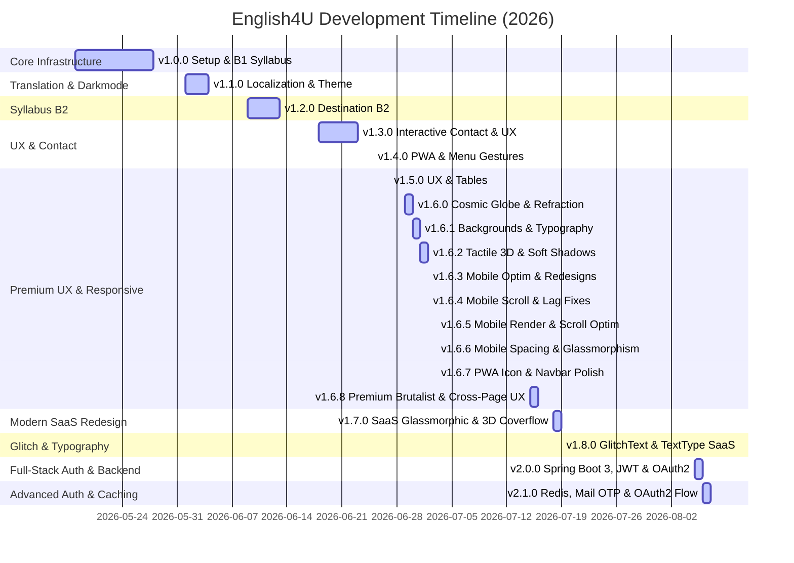

# 📑 CHANGELOG — English4U

All notable changes to the **English4U** project are documented below. This project adheres to **Semantic Versioning** (`vMAJOR.MINOR.PATCH`).

---

## 📊 Project Status & Quick Stats

| Key Metrics         | Value / Badges                                                                                                                             |
| :------------------ | :----------------------------------------------------------------------------------------------------------------------------------------- |
| **Current Version** |                                               |
| **Framework**       |                                  |
| **Styling**         |                                              |
| **Language**        |                           |
| **Build Status**    |  |

---

## 🗺️ Release Roadmap & Summary



---

## 🚀 v2.1.0 — Redis Caching & Token Blacklist, Mail OTP Password Recovery, Multi-Step OTP UI, Google OAuth2 Rehydration & Containerized Docker Architecture

> **Release Date:** August 07, 2026 • _Focus: Redis Caching & Distributed Token Security (Refresh Token Whitelist & Access Token Blacklist), Email Verification OTP System with Thymeleaf HTML Templates, Anti-Spam Redis Rate Limiting, Multi-Step OTP Password Reset UI (6-digit Auto-Focus Inputs & 60s Resend Timer), Google OAuth2 Redirect Rehydration Handler, and Full-Stack Docker Container Orchestration_

```
┌──────────────────────────────────────────────────────────────────┐
│  ✨ Highlights:                                                  │
│  • Redis Caching & Token Security (Refresh Whitelist & Blacklist)│
│  • Redis Rate Limiting (Anti-spam 10 requests / 15 mins for OTP) │
│  • JavaMailSender + Thymeleaf HTML Email Template for OTPs       │
│  • Full Multi-Step Password Recovery Flow (/forgot-password)     │
│  • 6-Digit Auto-Focus OTP Input with 60s Resend Countdown Timer  │
│  • Google OAuth2 Rehydration Handler (/oauth2/redirect)          │
│  • Containerized Docker Orchestration (Spring Boot, MySQL, Redis)│
│  • Whitelisted Auth Endpoints in api-client.ts to prevent false 401s│
└──────────────────────────────────────────────────────────────────┘
```

### ⚡ Backend Spring Boot Architecture (`english4u-backend`)
- **Redis Token Management & Security**:
  - `RedisTokenService` & `RedisTokenServiceImpl`: Persistent Refresh Token Whitelisting (`RT:<email>`) in Redis with configurable TTL.
  - Access Token Blacklisting (`BL:<accessToken>`) on logout with remaining token TTL to prevent token reuse.
  - `JwtAuthenticationFilter`: Integrated Redis Blacklist verification (`redisTokenService.isAccessBlacklisted(jwt)`) before authenticating requests.
  - User Token Revocation: Automatically revokes all active Refresh Tokens for a user on password reset to force logout across all active devices.
- **Email Service & Password Reset (Forgot / Reset Password)**:
  - `OTPService` & `OTPServiceImpl`: Generates 6-digit numeric OTPs stored in Redis (`OTP:FORGOT:<email>`) with 5-minute TTL.
  - **Redis Rate Limiting**: Anti-spam rate limiting enforced via Redis (`RATE_LIMIT:FORGOT:<email>`), capping reset requests to 10 requests / 15 minutes.
  - `EmailService` & `EmailServiceImpl`: Generates styled HTML emails via Thymeleaf template `templates/mail/reset-password-email.html`. Includes Dev Mode console log fallback for local testing without real SMTP.
  - `PasswordResetController`: Exposes `/api/v1/auth/forgot-password`, `/api/v1/auth/verify-otp`, and `/api/v1/auth/reset-password`.
- **OAuth2 & Spring Security**:
  - `CustomOAuth2UserService` & `OAuth2SuccessHandler`: Handles Google & GitHub login callbacks, stores Refresh Tokens in Redis, issues HTTP-Only Cookies, and redirects to `/oauth2/redirect`.
  - `SecurityConfig`: Permitted public access to password recovery and OAuth2 endpoints.

### 🎨 Frontend Next.js App Router (`english4u`)
- **Social Login Component**:
  - `SocialLoginButtons.tsx`: Reusable component for Google & GitHub social auth buttons integrated in `LoginForm` and `RegisterForm`.
- **Multi-Step Password Recovery UI**:
  - `ForgotPasswordForm.tsx`: Step 1 Email input form triggering OTP generation.
  - `OTPVerifyForm.tsx`: Step 2 OTP verification featuring 6 individual numeric inputs with auto-focus, backspace navigation, paste support, and a 60-second countdown timer for the Resend OTP button.
  - `ResetPasswordForm.tsx`: Step 3 New password form with client-side validation and success confirmation.
  - `src/app/(auth)/forgot-password/page.tsx` & `src/app/(auth)/reset-password/page.tsx`: Pages built with English4U's Liquid Glass UI theme.
- **OAuth2 Redirect Handler & State Management**:
  - `src/app/oauth2/redirect/page.tsx`: OAuth2 callback handler fetching `/auth/me`, re-hydrating `AuthContext`, and executing full page navigation (`window.location.href`) to `/home` to ensure Navbar and layout cache update immediately without requiring manual `Ctrl+Shift+R`.
  - `api-client.ts`: Updated `isAuthEndpoint` whitelist to include `/auth/forgot-password`, `/auth/verify-otp`, and `/auth/reset-password` to prevent false "Session Expired" popups.

### 🐳 Containerized Docker Infrastructure
- **Docker Compose Orchestration**: Containerized multi-service environment (`english4u-backend` on Spring Boot 3, `english4u-mysql` on MySQL 8.0, `english4u-redis` on Redis 7-alpine).
- **Environment Synchronization**: Synced `MAIL_USERNAME` and `MAIL_PASSWORD` env vars between `.env`, `docker-compose.yml`, and `application.properties`.

---

---

## 🚀 v2.0.0 — Spring Boot 3 Backend Architecture, Full-Stack JWT Auth, Google & GitHub OAuth2, Cloudinary Storage & Profile Hero Redesign

> **Release Date:** August 06, 2026 • _Focus: Production Java Spring Boot 3 REST API Backend, Full-Stack HTTP-Only Cookie JWT Authentication, Google & GitHub OAuth2 Social Login, Cloudinary Image Storage, Facebook-Style Overlapping Profile Hero Banner, Session Expired Warning Modal, Confirm Logout Dialog, and EN/VI i18n System_

```
┌──────────────────────────────────────────────────────────────────┐
│  ✨ Highlights:                                                  │
│  • Full-stack Java Spring Boot 3 REST Backend (Java 17, JPA, MySQL)│
│  • Secure HTTP-Only Cookie JWT Authentication System            │
│  • Google & GitHub OAuth2 Social Login Integration & Handlers    │
│  • Cloudinary Java SDK Integration for Avatar & Cover Uploads    │
│  • Facebook-Style Profile Hero Banner (208px overlapping avatar) │
│  • Global Session Expired Popup Modal with Auto-Redirect to /login│
│  • Universal Confirm Logout Modal with double-confirmation flow │
│  • EN/VI i18n Translation Dictionaries & Auth Form Toggle Pills  │
│  • Expanded Auth Form Card padding and spacious input typography │
└──────────────────────────────────────────────────────────────────┘
```

### ☕ Java Spring Boot 3 Backend Architecture (`english4u-backend`)
- **Core Technology Stack**: Initialized production Java Spring Boot 3 REST API service using Java 17, Spring Security 6, Spring Data JPA, Hibernate, Lombok, and MySQL 8.
- **JWT Security Interceptor**: Built `JwtAuthenticationFilter` using `jjwt 0.12.6` to parse and validate HTTP-Only bearer cookies (`accessToken` & `refreshToken`) on protected API routes while rejecting unauthenticated access with clean HTTP 401 JSON payloads.
- **REST Endpoints**:
  - `/api/v1/auth/register`: User registration with BCrypt password hashing and `ROLE_USER` assignment.
  - `/api/v1/auth/login`: User login returning HTTP-Only JWT cookies.
  - `/api/v1/auth/refresh`: Access token refresh flow using refresh token cookie.
  - `/api/v1/auth/logout`: Secure cookie destruction and security context cleanup.
  - `/api/v1/auth/me`: Current user session details endpoint.
  - `/api/v1/users/profile`: Full name, avatar URL, and cover photo profile updates.
  - `/api/v1/upload/image`: Multipart image file upload endpoint.

### 🔑 Google & GitHub OAuth2 Social Authentication
- **OAuth2 Client Integration**: Integrated `spring-boot-starter-oauth2-client` with custom `OAuth2SuccessHandler` class (`OAuth2SuccessHandler.java`).
- **Auto-Provisioning**: Automatically provisions new database accounts with `ROLE_USER`, `email`, `fullName`, and `avatarUrl` upon successful OAuth2 callback from Google or GitHub.
- **Spring Security Endpoint Mapping**: Permitted OAuth2 authorization routes (`/oauth2/authorization/*`) and redirection callback URIs (`/login/oauth2/code/*`).
- **Social Login Buttons**: Added responsive Google (SVG logo) and GitHub (Octocat logo) login/register buttons to `LoginForm` and `RegisterForm` with an `"OR CONTINUE WITH"` divider.

### ☁️ Cloudinary Storage & Facebook-Style Profile Hero Banner
- **Cloudinary Integration**: Added Cloudinary Java SDK (`com.cloudinary:cloudinary-http44:1.39.0`) and configured `CloudinaryConfig`, `CloudinaryService`, and `UploadController`.
- **Hero Cover Photo**: Redesigned `/profile` hero banner with high-impact cover photo (`user.coverUrl`, height `h-64 sm:h-80 md:h-96`) and a glassmorphic `"Edit Cover"` camera button.
- **Overlapping Avatar**: Designed 208px prominent overlapping circular avatar (`w-40 sm:w-48 md:w-52`, `-mt-24 sm:-mt-28 md:-mt-32`) with specular ring borders (`ring-8 ring-paper-canvas dark:ring-zinc-950`) and a 1-click camera upload button.

### 🛡️ Global Auth Modals & Session Security
- **Session Expired Warning Modal**: Implemented `auth:unauthorized` event listener in `AuthContext` to trigger a Framer Motion warning modal when JWT tokens expire or 401 errors occur. Clicking **OK** redirects to `/login`.
- **Confirm Logout Dialog**: Replaced instant logout actions across Desktop Navbar, Mobile Drawer, and Profile Page with a sleek modal asking *"Are you sure you want to log out of your account?"* with **Cancel** and **Logout** options.

### 🌐 EN/VI i18n System & Auth Form Toggle
- **Translation Dictionaries**: Created `user_profile-translation-vi.json` and `login_register-translation-vi.json` for full Vietnamese translation coverage.
- **LanguageProvider Merge**: Merged dictionaries into `LanguageProvider` for instant cross-application locale switching.
- **Auth Form Toggle Pills**: Added glassmorphic `EN | VI` toggle pills at the top of `LoginForm` and `RegisterForm`.
- **Spacious Layout Polish**: Expanded auth card container width (`max-w-lg`) and padding (`p-8 sm:p-10 md:p-12`) with increased input field spacing (`space-y-6 sm:space-y-7`).

---

## 🚀 v1.8.0 — GlitchText Headings, TextType Integration & SaaS Layout Balance

> **Release Date:** July 19, 2026 • _Focus: Page Heading GlitchText Upgrade, React-Bits TextType Integration, Resources Header Card 2-Column Redesign, Navbar GlassSurface Component, WebGL Shader Fix, and Mobile Card Readability_

```
┌──────────────────────────────────────────────────────────────────┐
│  ✨ Highlights:                                                  │
│  • Replaced page headings with GlitchText component while         │
│    preserving gradient text styles (text-gradient-heading)       │
│  • Integrated @react-bits/TextType-JS-CSS for smooth GSAP-driven │
│    typewriter subtitle animations with blinking cursor           │
│  • Redesigned Resources page header card into a balanced 2-column│
│    grid, eliminating right-side empty space                      │
│  • Aligned live database badge (3,500+ Records) to top-right     │
│  • Upgraded Navbar container to GlassSurface component           │
│  • Fixed WebGL GLSL shader compilation error in LiquidShader     │
│  • Enhanced mobile card text contrast and z-index layering       │
└──────────────────────────────────────────────────────────────────┘
```

### ⚡ GlitchText & Typography System
- **Gradient Text Compatibility**: Refactored `GlitchText` CSS and component implementation to allow text gradient classes (`text-gradient-heading`) without hardcoded white text or dark background boxes on pseudo-elements.
- **Recursive Text Extraction**: Added `extractText()` helper in `GlitchText.tsx` to safely extract plain text from React nodes and fragments, eliminating `[object Object]` stringification bugs in `data-text`.
- **TypeScript Conversion**: Converted `GlitchText` to native `GlitchText.tsx` and removed duplicate `.jsx` proxy files to resolve Next.js Turbopack module factory conflicts.
- **Page Headings Migration**: Applied `GlitchText` to main headings on Contact page (`"Keep in touch."`, `"Let's create something together."`), Resources page (`"All-in-One Destination Synthesis"`), and Hero section (`"Master English"`, `"Grammar & Vocabulary"`).

### ✍️ React-Bits TextType Integration
- **New Component**: Integrated `@react-bits/TextType-JS-CSS` (`TextType.tsx` / `TextType.css`) featuring GSAP-powered smooth character typing, configurable pause/delete speeds, and custom blinking cursors (`|`).
- **Hero Subtitle Upgrade**: Replaced manual `useState`/`useEffect` typewriter code loops in `HeroSection` with the `TextType` component.

### 🎨 Resources Page Header Redesign
- **Balanced 2-Column Grid**: Redesigned `ResourcesPage` header card into a symmetrical 12-column grid layout (`grid grid-cols-1 lg:grid-cols-12 gap-8 lg:gap-12 items-center`). Left column (`lg:col-span-6`) contains badges, GlitchText title, and description text; right column (`lg:col-span-6`) houses the 6 resource category stat cards in a clean 2x3 grid, eliminating empty white space.
- **Top Meta Bar Alignment**: Positioned the `3,500+ Records` live database counter badge cleanly on the far right of the top meta bar, aligned with the outer card boundary.
- **Interactive Stat Cards**: Enhanced stat cards with colorful accent indicator dots, count metrics, hover scale transitions (`hover:scale-[1.03]`), and glowing active ring highlights.

### 🔍 Navbar GlassSurface & WebGL Fixes
- **GlassSurface Navbar Integration**: Applied `GlassSurface` component (`GlassSurface.jsx`) to `navbar.tsx` with responsive light/dark surface parameters.
- **Shader Compilation Fix**: Fixed WebGL GLSL fragment shader `hash()` precision overflow in `LiquidShaderBackground.tsx` to prevent GPU driver compilation errors.
- **Mobile Card Readability**: Wrapped card children inside `relative z-10` containers across `card.tsx`, `globals.css`, and `learning-explorer.tsx` so text sits above background glass layers on touch screens.
- **Contact Bubbles Asset**: Updated floating contact widget toggle button to use `/imgs/contactBubble.png`.

---

## 🚀 v1.7.0 — Modern SaaS Glassmorphic Redesign & 3D Coverflow Gallery

> **Release Date:** July 19, 2026 • _Focus: Complete Visual Theme Migration from Flat Brutalist to Modern SaaS/Glassmorphic, 3D Coverflow Destination Selector, Sticky Sidebar Fix, Premium Book Cover Generation, and Dynamic Detail Panels_

```
┌──────────────────────────────────────────────────────────────────┐
│  ✨ Highlights:                                                  │
│  • Full visual migration from Flat Brutalist to Modern SaaS with │
│    glassmorphic translucent cards, pill buttons, and soft shadows│
│  • 3D Coverflow Gallery for "Choose Your Destination" selector   │
│  • AI-generated premium abstract book covers for B1, B2, C1/C2  │
│  • Fixed sticky sidebar index with CSS specificity override      │
│  • Dynamic animated detail panel synced to active coverflow card │
│  • Floating contact chat bubbles (Chatbot AI, Zalo, Messenger)  │
└──────────────────────────────────────────────────────────────────┘
```

### 🎨 Modern SaaS Glassmorphic Design System
- **Card System Overhaul**: Replaced all flat brutalist cards (solid 2px black borders, rigid 3D drop-shadow offsets) with a premium glassmorphic system in [globals.css](file:///k:/ProjectGitHub/English4U/english4u/src/app/globals.css) — translucent `rgba(255,255,255,0.6)` backgrounds with `backdrop-filter: blur(24px) saturate(120%)`, soft `inset` specular highlights, and smooth `rounded-[24px]` corners.
- **Typography Migration**: Switched the global font stack from monospace (`font-abc-diatype-mono`) to clean sans-serif (`Inter` / `Untitled Sans`) across [globals.css](file:///k:/ProjectGitHub/English4U/english4u/src/app/globals.css), [card.tsx](file:///k:/ProjectGitHub/English4U/english4u/src/components/ui/card.tsx), and body text elements. Monospace is now reserved for code blocks and metric badges.
- **Pill Button Variants**: Redesigned all button variants in [button.tsx](file:///k:/ProjectGitHub/English4U/english4u/src/components/ui/button.tsx) to `rounded-full` pill shapes with smooth hover scale (`1.03`), active tap shrink (`0.98`), and subtle drop shadows on primary CTAs.
- **Section Badge Capsules**: Standardized `.section-badge` styling as rounded pill badges with soft blue backdrop tint and matching translucent borders.
- **Data Table Glassmorphism**: Upgraded [data-table.tsx](file:///k:/ProjectGitHub/English4U/english4u/src/components/ui/data-table.tsx) with translucent borders (`border-zinc-200/50` / `border-zinc-800`), transparent body elements, and subtle backdrop blur on the wrapper.
- **Dark Mode Refinement**: Calibrated dark theme cards to `rgba(11, 15, 25, 0.65)` with warm white `0.08` opacity borders and refined inner specular shadows for depth.

### 🎠 3D Coverflow Destination Selector
- **New Component**: Created [coverflow-gallery.tsx](file:///k:/ProjectGitHub/English4U/english4u/src/components/ui/coverflow-gallery.tsx) — a reusable 3D coverflow carousel built from the user's `coverflowGalery.md` template. Features CSS 3D transforms with `preserve-3d`, configurable tilt/rotation/gap/opacity, keyboard navigation, optional autoplay, and interactive card click callbacks (`onActiveCardClick`, `onActiveCardChange`).
- **Book Selection Redesign**: Refactored [book-selection.tsx](file:///k:/ProjectGitHub/English4U/english4u/src/components/sections/book-selection.tsx) — replaced the static 3-column card grid with the 3D Coverflow Gallery. A dynamic glassmorphic detail panel beneath the gallery animates (`framer-motion` `AnimatePresence`) in sync with the active slide, showing the book title, unit count badge, description, and a contextual CTA button.
- **AI-Generated Book Covers**: Generated three premium abstract glassmorphic book cover images using AI:
  - `destination-b1.png` — Cyan and deep blue glass spheres with neon accents
  - `destination-b2.png` — Saffron, warm orange, and copper-gold metallic lines
  - `destination-c1-c2.png` — Deep violet, sunset purple, and neon pink chrome rings
- **Responsive Gallery**: Card dimensions adapt on mobile (`260×260px`) vs desktop (`360×360px`), with adjusted gap spacing for comfortable touch interaction.

### 📌 Sticky Sidebar Index Fix
- **Root Cause Resolution**: The Units Index sidebar in the Learning Explorer was unable to use CSS `position: sticky` because the `.liquid-glass` class in `globals.css` applied `position: relative !important`, overriding Tailwind's `sticky` utility. Additionally, parent containers (`<main>` and `<section>`) used `overflow-x-clip`, which breaks sticky scroll context propagation.
- **Fix Applied**:
  1. Removed `!important` from `position: relative` in the `.liquid-glass` class definition.
  2. Removed `overflow-x-clip` from the `<main>` tag in [destination/[level]/page.tsx](file:///k:/ProjectGitHub/English4U/english4u/src/app/destination/%5Blevel%5D/page.tsx) and the `<section>` tag in [learning-explorer.tsx](file:///k:/ProjectGitHub/English4U/english4u/src/components/sections/learning-explorer.tsx).
  3. Applied inline `style={{ position: "sticky", top: "110px" }}` on the sidebar `<aside>` element for maximum CSS specificity.

### 🗨️ Floating Contact Chat Bubbles
- **New Component**: Added [ContactBubbles.tsx](file:///k:/ProjectGitHub/English4U/english4u/src/components/ui/ContactBubbles.tsx) — a vertical group of floating contact icons (Chatbot AI, Zalo, Messenger) fixed at the bottom-right corner of the viewport with gentle floating animations.

### 🔄 Cross-Page Style Alignment
- **Resources Page**: Replaced solid backgrounds and heavy borders with translucent glassmorphic cards, rounded-full search capsules, and clean gray pagination controls.
- **Contact Page**: Migrated panels to borderless `liquid-glass` grids, modernized form inputs with `font-sans` and thin `border-zinc-200/50` frames, restyled the send button as a rounded-full blue SaaS pill.
- **Learning Explorer**: Transformed the units index sidebar into a translucent `liquid-glass` drawer, updated coverflow tab triggers with active blue gradient borders, and redesigned grammar/pronunciation tables.

---

## 🚀 v1.6.8 — Flat Brutalist Redesign & Cross-Page UX Consistency

> **Release Date:** July 16, 2026 • _Focus: Flat Brutalist Theme Migration, Hardware-Accelerated Spotlight Backdrops, Cross-Page Design Alignment, Sticky Scroll Navigation Fixes, and Micro-Interaction Animations_

```
┌──────────────────────────────────────────────────────────────────┐
│  ✨ Highlights:                                                  │
│  • Replaced heavy glassmorphism blobs with a Flat Brutalist card │
│    design system (solid borders, rigid 3D drop-shadow offsets)   │
│  • Implemented GPU-accelerated interactive spotlight grid lines │
│  • Unified layout, theme settings and background on all 4 pages  │
│  • Fixed CSS sticky scrollspy index by converting containers from │
│    overflow-hidden layout to overflow-x-clip                     │
│  • Upgraded unit sidebars & breadcrumbs with fluid spring motion │
└──────────────────────────────────────────────────────────────────┘
```

### 🎨 Flat Brutalist Design & Dark Mode
- **Brutalist Card Token Layout**: Upgraded card borders globally (`.liquid-glass`) to use a sharp `2px` black border and solid `4px` offset shadow (`shadow-3d-card`), utilizing `var(--radius-sm)` (6px) rounded corners on cards, buttons, input fields, checkboxes, and tags.
- **Vibrant Heading Gradients**: Applied high-contrast, theme-dependent CSS text gradients (`text-gradient-heading`, `text-gradient-badge`) to page hero headers, syllabus section headings, and category titles.
- **Comfortable Dark Slate Navy Theme**: Optimized the dark theme palette to use a soft slate-navy (`var(--atmosphere-wash)`) background, stardust gold borders, and elegant offset shadows, offering excellent visual contrast while remaining comfortable for the eyes.

### ⚡ GPU-Accelerated Spotlight Backdrop
- **Interactive Mouse Spotlight Grid**: Created the `<InteractiveBackground />` component to render interactive grid spotlighting following the user's cursor, using global CSS custom variables to set coordinates without triggering React re-renders.
- **GPU-bound Floating Auras**: Rendered dual ambient color auras floating slowly in the background, utilizing CSS animation keyframes and `will-change: transform` to run completely on the compositor thread (0% CPU scripting cost).

### 🐛 Layout Fixes & Cross-page Consistency
- **Syllabus Sidebar Sticky Scroll Fix**: Resolved standard sticky scroll breaks in `destination/[level]/page.tsx` and `resources/page.tsx` by replacing `<main>` container's `overflow-hidden` with `overflow-x-clip`, allowing the Left Sidebar Unit Index to stick relative to the viewport.
- **Omnipresent Layout Architecture**: Unified pages (Home, Destination, Resources, Contact) to inherit the same layout wrapper (Navbar, InteractiveBackground, `<main className="bg-paper-canvas dark:bg-black relative overflow-x-clip">`, Footer).

### 🎬 Delightful Micro-interactions
- **Tactile Sidebar Units Navigation**: Upgraded the Left Sidebar Unit buttons to `<motion.button>` with spring hover translate-x (`x: 4`) and scale-up (`scale: 1.02`) physics.
- **Accordion Label Transitions**: Added custom CSS translate-x transformations on accordion triggers to slide them gently to the right when hovered.
- **Table Hover Effects**: Updated table body rows across all tabs (Grammar, Vocabulary, Word Formation, etc.) to use a smooth background fade-in transition and custom mouse pointer classes on hover.
- **Breadcrumbs Entrance & Highlights**: Wrapped page breadcrumbs in dynamic motion entrance wrappers and added responsive bubble background highlights and icon scales on hover.

---

## 🚀 v1.6.7 — PWA Install Icon & Navbar Gradient Polish

> **Release Date:** July 3, 2026 • _Focus: PWA Installer Logo Customization, Dynamic Text Gradient Transitions, SVG Gradient Visibility Bugfixes, and React Style Conflict Mitigation_

```
┌──────────────────────────────────────────────────────────────────┐
│  ✨ Highlights:                                                  │
│  • Changed PWA manifest icons & apple-touch-icon to iconApp.png  │
│  • Refactored sw.js cache structure & bumped version to v2       │
│  • Created dynamic royal blue-white-orange text gradient links   │
│  • Fixed SVG display:none bug to make gear gradient visible      │
│  • Resolved React 19 style conflict (background shorthand warning)│
└──────────────────────────────────────────────────────────────────┘
```

### 📱 PWA & Offline Improvements
- **PWA Install Icon Customization**: Updated `manifest.json` and layout metadata `apple-touch-icon` to use `/imgs/iconApp.png` as the official installation logo on both desktop and mobile platforms, resolving the browser's default letter "E" fallback.
- **Service Worker Cache Streamline**: De-duplicated cached logo assets in `sw.js` and bumped the service worker's `CACHE_NAME` to `"english4u-v2"`, forcing the browser to clear old caches and immediately show the updated PWA installer icon.

### 🎨 Navbar & UI Gradients
- **Seamless Continuous Text Gradients**: Implemented dynamic segment-based text gradients on the 4 main desktop menu items (About, Destination, Resources, Contact) using brand logo colors (Royal Blue $\to$ White/Grey $\to$ Yellow/Orange) for a premium, integrated visual flow.
- **Gradient-Styled Settings Button & Gear Icon**: Applied the full three-color gradient to the Settings label text and configured the Lucide `<Settings>` gear icon outline to render with the gradient using SVG linearGradient stroke interpolation (`stroke="url(#settings-grad)"`).
- **SVG Gradient Visibility Fix**: Modified the backdrop SVG definition container inside `navbar.tsx` from `display: "none"` to zero size absolute positioning (`width: 0, height: 0`), preventing Chrome and Safari from dropping the gradient definitions.

### 🐛 React Compatibility & Fixes
- **Style Property Warning Resolution**: Resolved React's console styling warning ("Updating shorthand style property (background) when a conflicting sub-property is set") by replacing the `background` shorthand with `backgroundImage` inside the text gradient generator.

---

## 🚀 v1.6.6 — Mobile Spacing & Glassmorphism Refinement

> **Release Date:** July 3, 2026 • _Focus: WebGL Context Loss Recovery, Mobile Viewport Layout Optimizations, and Frosted Glassmorphism Fallbacks_

```
┌──────────────────────────────────────────────────────────────────┐
│  ✨ Highlights:                                                  │
│  • Fixed WebGL context loss & memory leaks in SplashCursor       │
│  • Restructured AudienceShowcase to a column-based timeline      │
│    layout, reclaiming 101px of horizontal space on mobile       │
│  • Optimized Contact & Resources mobile layouts & pagination     │
│  • Added tactile float animations & active state cursor pointer  │
│    overrides to the contact submit form controls                 │
│  • Enabled hardware-accelerated frosted glassmorphism on mobile   │
│    for Navbar, Units Index button, and syllabus sheets           │
│  • Injected a single-layer backdrop-filter: blur fallback into  │
│    GradualBlur on mobile touch screens for premium aesthetics    │
└──────────────────────────────────────────────────────────────────┘
```

### 🐛 Stability & Context Loss Fixes
- **WebGL Context Safeguards**: Enhanced `<SplashCursor>` with checks for `gl.isContextLost()` to stop rendering loop calls when WebGL contexts are destroyed (e.g. F12 viewport toggling), and handled null format extensions inside `initFramebuffers()` to prevent hydration crashes.
- **Code Duplication Removal**: Cleaned up the codebase by overwriting `src/components/SplashCursor.tsx` to re-export directly from `src/components/ui/splash-cursor.tsx`, keeping logic centralized.

### 📱 Responsive Layout & Spacing Optimizations
- **AudienceShowcase Timeline**: Converted the timeline component from an absolute vertical bar with hardcoded offsets to a robust, flexbox column-based layout. Reclaimed **101px** of horizontal content width on small viewports, expanding detail cards from 96px to 197px wide (+105% width gain) without screen clipping.
- **Resources Left-Alignment & Scrolling**: Left-aligned the page breadcrumbs inside the `.container` grid and implemented horizontal swiping (`overflow-x-auto`) with fixed circular touch targets (`shrink-0`) on mobile pagination buttons to prevent dashboard overflow.
- **Contact Card Alignment**: Relocated page breadcrumbs inside the container grid and migrated the form card paddings to responsive spacing to keep elements from touching the viewport edges.

### 🎨 Micro-interactions & Interactivity
- **Form Float Effects**: Wrapped the Contact inputs inside floating wrapper cards styled with smooth hover and focus-within translations (`md:hover:-translate-y-1`) for a tactile desktop response.
- **Submit Button Cursors**: Configured the contact submit button pointer events to allow active cursors even when disabled. Hovering shows a `cursor-not-allowed` icon when inputs are empty, changing to a pointer hand and background color translations when inputs are validated.

### 🔮 Mobile Glassmorphism & Backdrop Blurs
- **Frosted Overlays**: Added `backdrop-blur-md` and `bg-paper-canvas/80` to the mobile Navbar, floating Units Index toggle bubble, and slide-up syllabus bottom sheet, ensuring background elements blur elegantly on touch screens.
- **SVG Filter Bypass**: Introduced `.mobile-glass-backdrop` in `globals.css` to disable complex SVG displacement filters (`filter: none !important`) on mobile viewports, preventing transparency and black block rendering bugs.
- **Gradual Blur Footer Fallback**: Updated the mobile rendering loop in `gradual-blur.tsx` to return a single-layer `backdrop-filter: blur(8px) saturate(120%)` gradient fade, creating a smooth glass footer overlay on mobile devices.

---

## 🚀 v1.6.5 — Mobile Render & Scroll Optimizations

> **Release Date:** July 3, 2026 • _Focus: Eliminating Heavy Backdrop Filters on Touch Devices, Optimizing 3D Shadows, and Simplifying Progressive Blurs_

```
┌──────────────────────────────────────────────────────────────────┐
│  ✨ Highlights:                                                  │
│  • Simplified GradualBlur on mobile/touch screens to render a    │
│    single CSS gradient layer instead of 5 backdrop-blur layers   │
│  • Disabled backdrop-filter on .liquid-glass-bg for touch screens│
│    to eliminate scroll stutter in card-heavy interfaces          │
│  • Applied CSS paint containment (contain: paint) to cards on    │
│    mobile to allow browser rendering engine to skip off-screen rendering│
│  • Optimized 3D button and card shadows to use smaller blur/spread│
│    sizes on touch devices, reducing mobile GPU rasterization stress│
│  • Disabled hover translations on mobile to prevent sticky states│
└──────────────────────────────────────────────────────────────────┘
```

### ⚡ Rendering & Mobile Scroll Optimizations
- **GradualBlur Performance**: Enhanced `<GradualBlur>` with a runtime `isMobile` check (using `matchMedia` pointer coarse & viewport size), replacing the heavy multi-layer blur cascade with a single, highly performant CSS gradient layer fading to `var(--paper-canvas)`.
- **Mobile Backdrop-Filter Bypass**: Modified `.liquid-glass-bg` on mobile to disable `backdrop-filter: blur`, replacing it with a slightly more opaque solid alpha color to maintain text readability without the high drawing cost.
- **CSS Paint Containment**: Added `contain: paint !important` to `.liquid-glass` cards on touch screens, instructing the rendering engine to clip and optimize paint updates outside the bounding box, saving viewport rasterization CPU cycles.
- **3D Shadow Simplification**: Scaled down shadow sizes (`box-shadow`) on mobile screens to minimize blur calculations, and turned off hover transforms on `pointer: coarse` screens to avoid unnecessary layout triggers on tap events.

---

## 🚀 v1.6.4 — Mobile Scroll Optimization & Lag Fixes

> **Release Date:** July 2, 2026 • _Focus: Resolving Mobile Checkerboarding, Bypassing JS Smooth Scrolling on Touch Devices, and Throttling Scroll Event Listeners_

```
┌──────────────────────────────────────────────────────────────────┐
│  ✨ Highlights:                                                  │
│  • Bypassed Lenis Smooth Scroll on mobile devices to restore     │
│    native hardware-accelerated momentum scrolling                 │
│  • Bypassed Parallax Background canvas rendering on mobile,      │
│    substituting it with a static, CSS-rendered dot grid pattern   │
│  • Throttled scroll speed calculations and state changes in the   │
│    Syllabus Learning Explorer to once every 100ms                │
│  • Suspended IntersectionObserver scrollspy active unit tracking  │
│    on mobile while the index drawer is closed                     │
└──────────────────────────────────────────────────────────────────┘
```

### ⚡ Mobile Performance & Scroll Optimizations
- **Native Scroll Restore**: Modified `<SmoothScrollProvider>` to conditionally bypass `<ReactLenis>` on screens under `768px`, eliminating heavy JavaScript-driven touch interpolation.
- **Canvas Rendering Off-loading**: Optimised `<ParallaxBackground>` on mobile viewports by disabling dual 2D canvas initialization and `requestAnimationFrame` render loops, returning a simple, highly-efficient CSS `radial-gradient` pattern instead.
- **Scroll Speed Listener Throttle**: Throttled `handleScroll` in `<LearningExplorerSection>` using a 100ms timer and added a local closure tracker to prevent redundant state updates on every scroll frame.
- **Selective Scrollspy Observer**: Configured the IntersectionObserver scrollspy in `learning-explorer.tsx` to mount only when the mobile drawer is open (`isMobileDrawerOpen`), completely eliminating background re-render cascades during page scrolling.

---

## 🚀 v1.6.3 — Mobile Optimization & Contact Redesign

> **Release Date:** July 2, 2026 • _Focus: Performance Optimizations, Mobile Lag Reductions, Contact Page Premium Glassmorphism, and Learning Explorer Spacing & Alignment Fixes_

```
┌──────────────────────────────────────────────────────────────────┐
│  ✨ Highlights:                                                  │
│  • Eliminated mobile WebGL initialization lag by safeguarding     │
│    ThreeDCanvas with mounted/hydration checks and responsive bounds│
│  • Disabled dynamic displacement filters & shimmer tickers globally│
│  • Temporarily disabled unused 3D Grammar Book & Global Globe      │
│  • Redesigned Contact Page to a premium responsive glassmorphic    │
│    asymmetric layout with modern title gradients & unified cards  │
│  • Fixed Mobile Learning Explorer unit titles alignment and       │
│    shortened the unit dividers with horizontal margin indents      │
└──────────────────────────────────────────────────────────────────┘
```

### ⚡ Performance & Mobile Optimizations
- **ThreeDCanvas Safeguard**: Added `mounted` state checking to prevent WebGL contexts from rendering on mobile devices during initial hydration/paint.
- **Liquid Glass Displacements**: Commented out SVG wave refraction displacement filters on all cards and dropdowns to improve scrolling performance on both desktop and mobile.
- **3D Scenes Restructuring**: Commented out the unused conditional rendering loops for the 3D Grammar Codex book and Global Network globe inside `<ThreeDCanvas>` to reduce render loop thread weight.

### 🎨 Premium UI & Redesigns
- **Contact Page**: Redesigned the entire route into a premium asymmetric dual-card interface.
  - Wrapped both columns in `.liquid-glass .border-3d .shadow-3d-card` containers with generous responsive paddings (`p-6 sm:p-8 md:p-10`) and modern rounded corners (`rounded-[30px]`).
  - Added a modern color-gradient text-gradient to the `"Keep in touch."` title.
  - Aligned inputs, file uploads, text areas, and social media channels onto a layered, clean glass surface.
  - Fixed responsive title scaling to prevent wrapping issues on small mobile devices.

### 🐛 Layout & Bug Fixes
- **Learning Explorer Title Alignment**: Added `text-left` and `px-2 sm:px-4` to the unit accordion triggers in `learning-explorer.tsx` to prevent default browser centering on mobile buttons.
- **Unit Divider Line Length**: Indented `<AccordionItem>` elements using `mx-4 sm:mx-6` to make the bottom border lines shorter and avoid touching the outer card borders.

---

## 🚀 v1.6.2 — Tactile 3D & Soft Shadows

> **Release Date:** July 2, 2026 • _Focus: Tactile 3D Design System, Responsive Text Gradients, Full-Width Vocab Cloud, Glassmorphic Sidebar & Tab Blur, and Mobile Controls Adjustments_

```
┌──────────────────────────────────────────────────────────────────┐
│  ✨ Highlights:                                                  │
│  • Redesigned UI to a premium tactile 3D style using soft shadows  │
│  • Replaced harsh solid black borders with elegant translucent ones│
│  • Applied premium responsive text gradients in Hero & Explorer   │
│  • Expanded interactive 3D Vocab Cloud to full viewport width     │
│  • Applied glassmorphic backdrop-blur to Index Menu & Tabs       │
│  • Repositioned mobile scroll buttons and built draggable index  │
└──────────────────────────────────────────────────────────────────┘
```

### 🎨 Tactile 3D Design System & Soft Shadows

- **Soft 3D Shadows:** Redefined the global `.shadow-3d-btn`, `.shadow-3d-card`, and `.shadow-3d-popup` to use a soft `--shadow-3d-color` variables (`rgba(36, 36, 36, 0.15)` in light mode, `rgba(226, 193, 97, 0.18)` in dark mode) for a smooth **gradual-blur** shadow rather than solid black blocks.
- **Translucent Borders:** Softened `.border-3d` to use a semi-translucent gray border in light mode (`rgba(36, 36, 36, 0.12)`) and gold-tinted translucent border in dark mode, removing the solid black outlines globally.
- **Settings & Card Overrides:** Set the navbar Settings button to use transparent borders to let the 3D soft shadow stand out, and overrode the outer Live Playground card's border to a translucent white border (`!border-white/40 dark:!border-white/10`).
- **All Tabs 3D:** Styled all playpen tab buttons (active and inactive) to be 3D blocks. Inactive tabs now have a soft background, light borders, and soft shadows, lifting on hover.

### 🌈 Premium Text Gradients & Background Layer

- **Responsive Text Gradients:** Applied vibrant, responsive gradients to Hero and Learning Explorer headings (translating from charcoal/deep-purple to warm coral/fresh-mint in light mode, and stardust gold to warm peach/white in dark mode).
- **Subtitles & Cursors:** Styled subtitles with a readable metallic fade and customized blinking typing cursors with matched gradient accents.
- **Section Background Image:** Integrated `/imgs/bg8.png` as an absolute background image layer (`-z-10`) behind all Learning Explorer contents.
- **Glassmorphic Index Menu & Tabs:** Applied `bg-paper-canvas/30 backdrop-blur-lg` to the desktop Left Sidebar ("Units Index") and global `TabsList` elements, rendering underlying backgrounds with premium glassmorphic frosted blur.

### 📱 Mobile UI & Layout Adjustments

- **Draggable Snapping Syllabus Index:** Replaced the purple syllabus button with a draggable glassmorphic bubble menu button featuring a Menu icon, including edge-snapping (16px left/right bounds) and vertical boundary clamping.
- **WebGL Mobile Off-loading:** Disabled `<ThreeDCanvas>` rendering on screens under `768px` in `book-selection.tsx` and `ThreeDWorkspace.tsx` to optimize mobile battery life and performance.
- **Scroll Controls Repositioning:** Moved mobile speed-sensitive scroll buttons to the bottom center of the screen (`fixed bottom-6 left-1/2 -translate-x-1/2`).
- **Full-Width Vocab Cloud:** Restructured `book-selection.tsx` to stretch the interactive 3D Vocab cloud across the full screen viewport, letting the rounded book cards float in the center on top.

---

## 🚀 v1.6.1 — Shared Backgrounds & Rainbow Typography

> **Release Date:** July 1, 2026 • _Focus: Unified Shared Section Backgrounds, Calibrated Rainbow Text Gradients, 3D Background Integration & Refractive Glass Navbar_

```
┌──────────────────────────────────────────────────────────────────┐
│  ✨ Highlights:                                                  │
│  • Unified background wrappers using bg4.png & bg8.png images      │
│  • Calibrated, high-end rainbow text gradients for headings/badges │
│  • 3D Vocab Cloud Constellation integrated as a section background│
│  • Gradual blur component converted to scroll-reactive glass      │
│  • Gradual glassmorphism applied as the Navbar's background      │
└──────────────────────────────────────────────────────────────────┘
```

### 🖼️ Unified Homepage Background Wrappers

- **Shared Background Layouts:** Wrapped the homepage sections into two containers with inline background styles (`bg4.png` and `bg8.png`), creating a smooth visual path across sections instead of separated gradient stripes.
- **Fixed Stacking Context:** Declared z-index stacking boundaries (`z-0` on parent, `-z-10` on absolute backgrounds) to prevent background images from slipping behind the page body canvas.
- **404 About Redirect:** Fixed desktop and mobile navbar links to redirect "About" clicks safely back to `/` homepage, avoiding a 404 page error.

### 🌈 Calibrated Rainbow Typography

- **Rainbow Heading Gradients:** Replaced solid `text-ink` and simple two-color gradients with a premium, calibrated rainbow spectrum (`linear-gradient`) on all section headers. Light mode has deep, readable contrast tones while dark mode glows with vibrant neons.
- **Synchronized Badges:** Standardized all section subtitles to a unified capsule format using `.section-badge` and `.text-gradient-badge` with synchronized rainbow text gradients.
- **Refined Body Text Colors:** Replaced grey tones with a premium warm stone-charcoal (`#2e2a27`) in light mode and warm cream-ivory (`#eae6df`) in dark mode to maximize text legibility.

### 🔮 3D Background & Refractive Glass Navbar

- **3D Vocab Cloud Background:** Dynamically loaded the 3D WebGL vocab constellation in the background of the Destination level selection section (`book-selection.tsx`). Stretched coordinates horizontally ($2.4\times$) and vertically ($1.2\times$) so the cloud floats across the entire section.
- **Refractive Gradual Blur:** Integrated scroll-velocity SVG displacement filter (`filter: url(#liquid-glass-refraction)`) into the `GradualBlur` component.
- **Navbar Glassmorphism Background:** Replaced the static backdrop blur of the navbar with `GradualBlur`, creating a dynamic refractive fluid glass bar that warps page contents sliding underneath it during scroll without clipping dropdown controls.

---

## 🚀 v1.6.0 — Cosmic 3D Globe & Dynamic Liquid Glass Refraction

> **Release Date:** June 30, 2026 • _Focus: Realistic 3D Earth Globe, Scroll-Reactive Liquid Glass Filter, Vibrant Section Gradients & Layered Border Separation_

```
┌──────────────────────────────────────────────────────────────────┐
│  ✨ Highlights:                                                  │
│  • Realistic 3D Earth Globe with bump mapping & glow ring        │
│  • Scroll-reactive SVG displacement refraction filter            │
│  • Isolation of borders & text from refraction to keep them sharp│
│  • Saturated three-color section gradient backgrounds            │
│  • Smooth 24px bo góc (rounded) card styling upgrade             │
└──────────────────────────────────────────────────────────────────┘
```

### 🌍 3D Earth Globe & Orbit System

- **Realistic Earth Visualization:** Built a complete 3D Earth sphere with custom vertex/fragment shading, realistic land/sea continent outlines, atmospheric glow ring, and rotational animation.
- **Particle Satellite Rings:** Retired the black-dot sphere and created three concentric orbiting stardust rings around the Earth representing B1, B2, and C1/C2 vocabulary streams.
- **Context Loss Recovery:** Enhanced the WebGL renderer setup to gracefully catch `webglcontextlost` events and dynamically remount the canvas.

### 🧪 Dynamic Liquid Glass Refraction

- **Scroll-Reactive Refraction:** Created `LiquidGlassFilter` to compute real-time scroll velocity, warping the backdrop-filter in a fluid gợn sóng (ripple) motion during fast scrolling.
- **Sharp Border Isolation:** Split the card aesthetics into an outer vector container (maintaining 100% crisp borders and readable text) and an inner `.liquid-glass-bg` layer containing the WebGL filter, avoiding jagged and broken lines.
- **24px Rounding Upgrade:** Modernized the card variants' corner radii to `rounded-[24px]` for a sleeker visual appearance.

### 🎨 Vibrant Three-Color Section Gradients

- **Multi-tone gradients:** Formulated three-color gradient backgrounds (`bg-section-*`) for all 11 homepage sections to support colorful glass light refraction.
- **Visual bridging:** Redesigned the color transitions for the playpen and explore sections to prevent clashing.

---

## 🚀 v1.6.0 — Cosmic 3D Globe & Dynamic Liquid Glass Refraction

> **Release Date:** June 30, 2026 • _Focus: Realistic 3D Earth Globe, Scroll-Reactive Liquid Glass Filter, Vibrant Section Gradients & Layered Border Separation_

```
┌──────────────────────────────────────────────────────────────────┐
│  ✨ Highlights:                                                  │
│  • Realistic 3D Earth Globe with bump mapping & glow ring        │
│  • Scroll-reactive SVG displacement refraction filter            │
│  • Isolation of borders & text from refraction to keep them sharp│
│  • Saturated three-color section gradient backgrounds            │
│  • Smooth 24px bo góc (rounded) card styling upgrade             │
└──────────────────────────────────────────────────────────────────┘
```

### 🌍 3D Earth Globe & Orbit System

- **Realistic Earth Visualization:** Built a complete 3D Earth sphere with custom vertex/fragment shading, realistic land/sea continent outlines, atmospheric glow ring, and rotational animation.
- **Particle Satellite Rings:** Retired the black-dot sphere and created three concentric orbiting stardust rings around the Earth representing B1, B2, and C1/C2 vocabulary streams.
- **Context Loss Recovery:** Enhanced the WebGL renderer setup to gracefully catch `webglcontextlost` events and dynamically remount the canvas.

### 🧪 Dynamic Liquid Glass Refraction

- **Scroll-Reactive Refraction:** Created `LiquidGlassFilter` to compute real-time scroll velocity, warping the backdrop-filter in a fluid gợn sóng (ripple) motion during fast scrolling.
- **Sharp Border Isolation:** Split the card aesthetics into an outer vector container (maintaining 100% crisp borders and readable text) and an inner `.liquid-glass-bg` layer containing the WebGL filter, avoiding jagged and broken lines.
- **24px Rounding Upgrade:** Modernized the card variants' corner radii to `rounded-[24px]` for a sleeker visual appearance.

### 🎨 Vibrant Three-Color Section Gradients

- **Multi-tone gradients:** Formulated three-color gradient backgrounds (`bg-section-*`) for all 11 homepage sections to support colorful glass light refraction.
- **Visual bridging:** Redesigned the color transitions for the playpen and explore sections to prevent clashing.

---

## 🚀 v1.5.0 — Premium UX Refactoring & Mobile Responsiveness

> **Release Date:** June 27, 2026 • _Focus: Gradient UI Cards, Interactive Micro-Animations, Responsive Tables, Directional Scroll-Nav & Hydration Fixes_

```
┌──────────────────────────────────────────────────────────────────┐
│  ✨🌟Highlights:                                                │
│  • Premium dynamic gradient background cards system              │
│  • Buttery smooth spring micro-animations using Framer Motion    │
│  • Complete redesign of grammar tables into stacked mobile cards   │
│  • Directional speed-sensitive scroll buttons overlay            │
│  • React hydration & layout shift spacing fixes                  │
└──────────────────────────────────────────────────────────────────┘
```

### 🎨 Premium Visual Redesign & Micro-Animations

- **Gradients Cards System:** Swapped flat theme wash elements with 4 key dynamic global CSS gradient tokens on Course Cards, Bento features, and playgrounds.
- **Spring physics animations:** Added custom spring-based scale, translation, and tap states to all main homepage sections to make the UI feel responsive and alive.
- **Hero Layout Stability:** Fixed dynamic typewriter expansion height shifts and resolved a React hydration className mismatch warning on `h1` components.

### 📱 Responsive Mobile Refactoring

- **Stacked mobile tables:** Rewrote `RichGrammarRenderer` layout rules to replace wide, horizontal-scrolling HTML tables with beautiful, structured stacked cards, badge indicators, and single-column flex grids.
- **Directional Scroll-Nav Overlay:** Implemented speed-sensitive scroll-up/down overlays on mobile viewport edges that dynamically render only the scroll direction icon (`ChevronUp` or `ChevronDown`) and automatically fade out after 2.5 seconds of inactivity.

---

## 🚀 v1.4.0 — Layout Refinement & PWA Integration

> **Release Date:** June 25, 2026 • _Focus: PWA Capabilities, Drag Gestures & Geometry Polish_

```
┌──────────────────────────────────────────────────────────────┐
│  ✨ Highlights:                                             │
│  • Full PWA integration with home-screen installation         │
│  • Sharp modern design system with optimized 10px rounded    │
│  • Framer Motion bottom sheet with velocity-drag actions    │
└──────────────────────────────────────────────────────────────┘
```

### 📱 Progressive Web App (PWA)

- **Features & Offline Capabilities:**
  - `3160344` Added full Progressive Web App configuration to enable standalone home-screen installation, cache manifest, and offline mode.
- **Stability Patches:**
  - `51b8302` Fixed `PwaProvider` initialization states to prevent layout blockages on browsers that do not support service workers.

### 🎨 Design & Layout Refinement

- **Visual Aesthetics & Geometry Update:**
  - `f0dcf5f` Polished global geometry tokens, refining the corner-rounding values of tables, cards, inputs, and tab containers. Reduced the base `--radius` variable from `40px` down to `10px` (20%–30% of original rounding) for a sleeker, more professional desktop and mobile aesthetic (excluding `Navbar`).
- **Mobile Experience Improvements:**
  - `navbar.tsx` Implemented a premium responsive bottom-sheet menu for mobile devices, using smooth Framer Motion vertical dragging (`drag="y"`) and velocity-based pull-to-dismiss drag mechanics.
  - `navbar.tsx` Upgraded the mobile hamburger drawer background to an elegant frosted glassmorphism effect featuring light/dark transparent overlay filters.

---

## 📦 v1.3.0 — Interactive Features & Performance

> **Release Date:** June 18 – June 23, 2026 • _Focus: Content Discovery & Performance Optimizations_

### ⚡ Performance & UX

- **Layout Shifts Mitigation:**
  - `353c841` Integrated page transition skeleton loaders to eliminate Layout Shifts (CLS) during route navigation.
- **Responsive Adjustments:**
  - `44fe7d7` Optimized grid layouts and CSS media queries for full compatibility with ultra-small mobile displays.

### ✍️ Communication & Navigation

- **Interactive Features:**
  - `d2f34c9` Built a rich-text Contact Us form, allowing users to send formatted emails with embedded base64 image attachments.
- **Syllabus Indexing:**
  - `e90c6e3` Introduced quick-access index navigation panels for Destination B1 & B2, improving vertical page scroll navigation.

---

## 🗺️ v1.2.0 — Destination B2 Expansion & Polish

> **Release Date:** June 9 – June 13, 2026 • _Focus: Advanced Syllabus Coverage & UI Consistency_

### 📚 Syllabus Expansion (Destination B2)

- **Curriculum Coverage:**
  - `55bb527` Integrated Units 1 to 12 of the Destination B2 syllabus with grammar summaries and color-coded key syntax highlights.
  - `7e8f344` Integrated B2 Syllabus Units 13 and 14.
  - `b4ea9c6` Integrated B2 Syllabus Units 15 and 16.
  - `1f9f5ae` Added B2 Syllabus Units 17 to 20 with highlighted examples.
  - `dc7ac5b` Completed the Destination B2 syllabus with Units 21 to 28.

### 🧭 Navigation & UI Polish

- **Navigation & Alerts:**
  - `1e6b924` Implemented dynamic breadcrumb pathways matching the current selected book level and unit context.
  - `ba93504` Added a custom floating Toast alert notification engine to handle system alerts, loading feedback, and network status.
- **Refinement & Merges:**
  - `18a8a84` Fine-tuned Navbar glassmorphism specular highlights to make navbar borders look more premium and responsive.
  - `6a9008e` Polished resource page grid cards and pagination controls for cleaner content hierarchy.
  - `e03e297` Resolved translation file conflicts and syntax merge mismatches.

---

## 🌐 v1.1.0 — Localization & Adaptive Themes

> **Release Date:** June 1 – June 4, 2026 • _Focus: Multi-Language Adaptability & Dark Theme_

### 🌍 Internationalization (i18n)

- **Localisation Setup:**
  - `1ce0d90` Configured the project's Core `i18n-localization` framework, enabling instant toggle switching between English and Vietnamese.
- **Content Translations:**
  - `af78a72` Completed Vietnamese translations for vocabularies in Units 12 through 42.
  - `8bb2f33` Translated grammatical guides for B1 Syllabus Units 1 to 11 and localized Resource page title card texts.
  - `ee0dfcb` Translated grammar concepts for Units 12 to 42 and localized the About panel sections.
  - `f3f8111` Localized core template blocks including the shared Navbar and Footer layouts.
  - `e957dae` Translated general text templates across About pages.

### 🌗 Dark Mode & Micro-interactions

- **Theme Integration:**
  - `aa6425b` Added tailwind-based custom dark theme config class mapping to enable native system theme switching.
- **Transitions & Tweaks:**
  - `2b6aa26` Integrated loading transition animations (animated gif assets) to ease route navigation waiting states.
  - `ee0dfcb` Polished active trigger states, refactored scroll pinions, and cleaned up dev-indicator floating action button interfaces.

---

## 🚀 v1.0.0 — Initial Release & B1 Syllabus

> **Release Date:** May 18 – May 28, 2026 • _Focus: Base Infrastructure & Initial B1 Core_

### 📚 Syllabus Integration (Destination B1)

- **B1 Syllabus Units:**
  - `be77cd5` Added Destination B1 Syllabus Units 1, 2, and 3.
  - `6330e8d` Refactored unit data structures into localized JSON configurations and added Units 4, 5, and 6.
  - `4f13e38` Added Units 7, 8, and 9.
  - `114c080` Added Units 10, 11, and 12, updating index structures.
  - `238b76b` Added Units 13, 14, and 15.
  - `d893b9b` Added Units 16, 17, and 18.
  - `37a58ce` Added Units 19, 20, and 21.
  - `838f0ac` Added Units 22, 23, and 24.
  - `0343d0a` Added Units 25, 26, and 27.
  - `948f998` Added Units 28, 29, and 30.
  - `6c84593` Added Units 31, 32, and 33.
  - `8041a1b` Added Units 34, 35, and 36.
  - `0017b37` Added Units 37, 38, and 39.
  - `b4d03b3` Completed the B1 syllabus integration by adding Units 40, 41, and 42.

### 🎨 Design & Infrastructure Setup

- **Boilerplate & Core Configurations:**
  - `b6e1b00` Scaffolded the initial codebase using Next.js App Router, configuring compilation targets and tsconfig parameters.
  - `a1f9be0` Configured webpack/turbopack CSS module support.
- **Branding & Smooth Scroll:**
  - `bdd200e` Handcrafted SVG brand vector logos and customized global footer interfaces.
  - `313703c` Integrated Lenis scroll library for hardware-accelerated smooth scrolling across viewports.
- **Visual Animations (GSAP):**
  - `b0a1900` Bound custom target element hover tracker cursor states using GreenSock (GSAP).
  - `784be64` Built fluid target cursor physics, gradual content blur transitions, and splash screen intro sequences.
  - `0d2d4d2` Hooked up standard entrance fade-ins and micro-interaction trigger animations.
- **Routing & UI Refinements:**
  - `6834aa6` Fixed destination level subfolder entry links and polished cursor interactions.
  - `67fd62d` Fixed get destination level 404 path issues and integrated information explorer headers.
  - `80bc3a8` Re-designed rules section layouts and modernized CSS style constants.
  - `6b74d74` Designed and styled the introductory About panel interfaces.
  - `af8adcd` Adjusted unit element displays and detail rendering templates.
